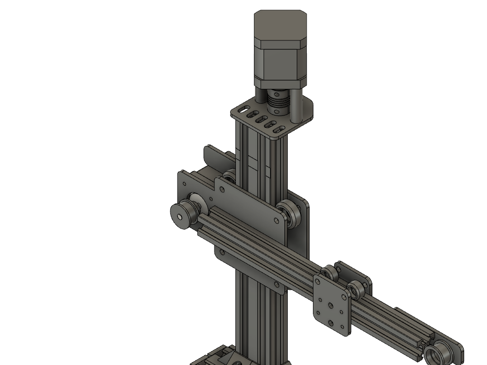

# 2d-printer

### Demo Movies

Please watch the following videos that show the printer in action drawing concentric circles and the impossible triangle!

### CAD Model

The following images were grabbed from the CAD model that I made of the printer before building starting. This reference helped my buy parts and visualize the build to minimize mistakes.

### Build Images

The following images are from the completed build.

### Hardware Overview

The printer is constructed with metal beams, acrylic (laser-cut) gantries, NEMA 17 stepper motors, 1 lead screw, 2 belts, 1 controller (essentially an Arduino Mega), and 1 24V power supply.

Constructing this printer was definitely the most challenging part of this project. Having to model things in CAD, make sure measurements were accurate down to the millimeter, choose the right parts, and so much more contributed to this not being an easy task; the planning and construction was definitely the most time consuming part.

The hardware provides three axes of motion (x, y, z) that allow a pen to draw on a roughly 2x3inch acrylic platform. In the future, I plan on turning this acryllic platform into a heated bed and swapping out the pen for an extruder to make a 3-D printer out of the 2-D printer.

### Code Overview

##### Controlling the Stepper Motors

To control the stepper motors, I mapped the motor leads to the corresponding pins on my controller by reading the spec sheet... there were a LOT of pins to map.
From there, I used a library called `AccelStepper` that tuned the current each motor needed and allowed me to run the motors in parallel to enable diagonal movement in addition to the standard linear motion in the {x,y,z}-axis directions.

In essence, what the stepper motor code provides is an abstraction of the drawing surface as an x-y cartesian plane with movement in the z-direction for raising and lowering the pen.

##### Drawing

One layer of abstraction up from the stepper motor control, I made classes that define things one can draw through manipulation of the motors, such as Point, Line, and Circle.

Point is simply an (x, y, z) coordinate pair, but it has some special functions that allow someone to visit that point with the pen raised (z-axis manipulation)or lowered.

Line is defined by two points. A user can either give both points when constructing a line, or, they  can give a point, a length, and an angle in radians.  In this second case, the constructor of Line will create a second point based on these arguments. Of course Line wouldn't be complete without a draw function :).

Circle is defined by a radius which is used in the equation r**2 = x**2 + y**2 which represents the circle. When someone calls `drawCircle()` the current (x, y)values become the circle center and we begin drawing the circle by giving an x value (which starts at r) solving for y, incrementing x, solving for y, and so on connecting each of the generated points with a line until a full circle is formed. Thus, we get a pretty good approximation of a circle. This can be seen in the video that is included with this submission.

### Running the Code

Before running the code, ensure that you have access to the `AccelStepper` library from the `2d-printer.ino` file. This may require you to move the library to the libraries directory that contains all of your Arduino libraries.

Once that is complete, you upload the sketch to the controller as you normally would.
